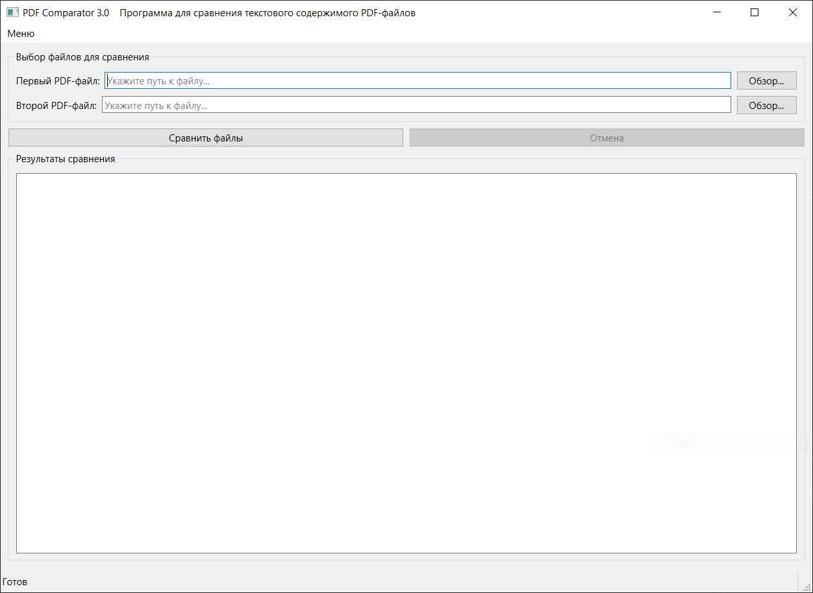

# PDF Comparator 3.0

Программа предназначена для сравнения 2-х файлов формата PDF, чтобы определить различия текста между ними. Как пример, это могут быть старая и новая версии оферты.

## Скриншоты

> 

## Возможности

- Сравнивает текстовое содержимое PDF-файлов
- Различия подсвечиваются цветами (красный - удаленное, зеленый - добавленное)
- Имеет графический интерфейс для удобства использования
- Два метода извлечения текста (pdfminer как основной, PyPDF2 как запасной)
- Поддержка HTML-форматирования в результатах (цветной текст)
- Фоновое выполнение сравнения с возможностью отмены
- Прогресс-бар в статусбаре
- Обработка ошибок

## Использование

1) Выберите два PDF файла текст в которых вы хотите сравнить.
2) Нажмите кнопку "Сравнить файлы"

## Структура проекта

- pdf-comparator/
- ├── main.py # Основной файл приложения
- ├── screenshots/ # Папка для скриншотов (для README)
- │ └── main-window.png # Пример скриншота
- ├── README.md # Этот файл
- └── requirements.txt # Файл зависимостей (см. ниже)

## Зависимости

- **Зависимости перечислены в файле `requirements.txt`**:
  - PySide6
  - PyPDF2
  - pdfminer.six

## Лицензия

Лицензия MIT - см. файл [LICENSE] для подробностей.

## Контакт

Иван Пожидаев[@firent] (<https://github.com/firent>) - <ivan@ivanpozhidaev.ru>

Ссылка на проект: [https://github.com/firent/pdf-comparator]
